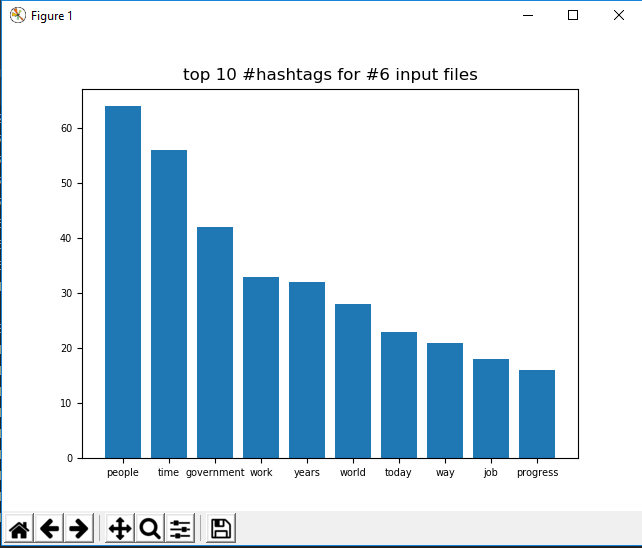

# Hashtag application
## Goal of this project

In high level the goal of this project is to calculate the most
common words (#hashtags) from the given text files as a data set.
More over it's a try to provide a clean and re-usable solution to make
it easy to investigate the results of the natural language algorithms
that are being used.

More specific this application uses the [nltk](https://www.nltk.org/)
to extract the word tokens, apply stemming in each word
using the Porter or Lancaster stemmer algorithms,
apply some custom filters and also a tagging filter with the help again
from nltk, and finally, in the end, it calculates the most common words
and saves/plots the results in a bar chart. The user can decide
the order of "filtering" and "stemming" the word tokens in this pipeline

## Installation
- create a new env or use the tags_env and install the requirements.
python 3.6 and above
>1. python -m pip install --upgrade pip
>3. python -m venv env_name
>4. or source tags_env/bin/activate
>5. pip install -r requirements.txt

## Running the tests
> python -m unittest tests/test_name

In my environment windows/PyCharm all the test's are passing.
There are a small bug with some of the unit test's under unix machines,
I need to check it again.

## Structure  of project

1. The core directory contains all the the "logic" of this app. I have
   split it in three main Classes. In the first one, data_loader.py I do
   the validation of the input files (for now it can accept only .txt
   files) and I create the necessary directories for the saves and the
   final results.Because I followed the strategy to extract the word
   tokens line by line and "carry" as a "references" the corresponding
   line and file for all the input files, in a custom "struct like
   class", and in case of input files are huge after this step I store
   the result as a checkpoint to be able to avoid the same calculation
   again.After this step the data will have the form a list of FileLine
   objects where in each FileLine object we have stored the token
   words,the corresponding line and file. The second main class is the
   filter pipeline where I have implemented a method to be able to
   register a new filter from (filters.py) in the pipeline, restore the
   result-effect in the input data from a previous execution on a
   specific filter and of course the apply method to execute all this
   filters. Because I wanted to save the result to be able to manually
   examine the jsons after each filter all the filters returns a list
   instead generators. In the final main class common_words.py I have
   the implementation of a custom dict where I can calculate all the
   unique words from all lines and files.I increase the counter only in
   case where I have a new line.In more detail in this class I'm
   accepting a list of ***objects FileLine(words,single line,single
   file)*** from previous steps(after filtering and or stemming) and I
   want to convert them as a dict (WordCounterDict) where each key is
   the word token and the values again a struct like class
   WordOccurrence with attributes the counter = len(lines), and two
   lists with all the lines and all the files that this word
   occur.***{"word": WordOccurrence(counter,lines,files)}***. The logic
   to determine the "common" words is based in the variable (criterion
   <= number of input files)*: Finally in this class when I want to test
   the results of the requested pipeline I use a generator to sort the
   common words based on the counter of each object(WordOccurrence) and
   also the number of results can be vary with the help of the top_k
   variable. In the stem.py there is only one function to choose between
   the PorterStemmer or the LancasterStemmer only for english
   vocabulary.
2. The saves directory will contain all the .pickle and jsons after each
   step of pipeline and also after the stemming to be able to restore
   from them.
3. The results directory will contain all the common words as a json for
   the requested parameters (top_k results and criterion=<=len(#input
   files), and a csv file/pdf with the bar plot of the final results.
4. The tools directory contains some helper functions for example the
   function to write/restore jsons pickle files and also a debug
   decorator and the logger of the app.
5. In the test directory I provide some unit test for the most important
   parts of this app.They need of course more improvement

6. Lastly the most interesting at least for me the app.py where we can
   play with the code and test how bad or good is the pipeline.

## Usage
>Run the main application python app.py,
>at the begging it will download all the necessarily packages from nltk.
>Where with typing help we have a list with all possible commands.

>We can print the default settings,
>The default value of the common criterion = 6 (all the input files)
>but we can decrease it,the logic for common is: each word is considered
>as a common word in files, if the number of files where this
>word exists >= criterion

>after setting the desired stemming algorithm we can add the filters
>or select add_all

>We execute the pipeline with the command apply,
>and then before calculate the final results we can configure
>the criterion and/or the top_k.

>with the command show, we calculate the final results.
>The result's after the counting for the requested criterion
>are stored in a json file.

> With the top_k variable we fetch only a portion of them

>An example of execution without any stemming algorithm and filter
> commands, parse -> show

>with the default settings
> parse -> stem -> filters -> show

>Also we can restore the state after a specific filter to request
>different outputs.

Finally all the results are stored in the directory results as a csv
with format: Words,#counter,line/s,document/s

